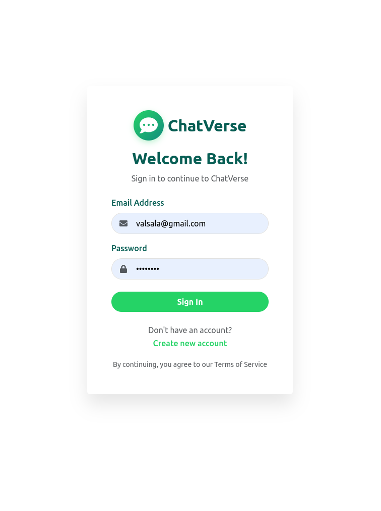
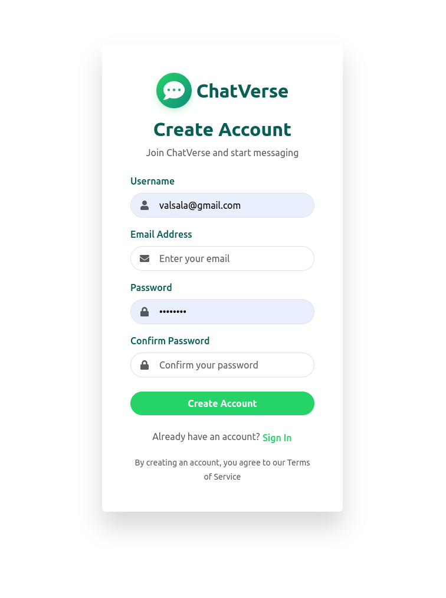
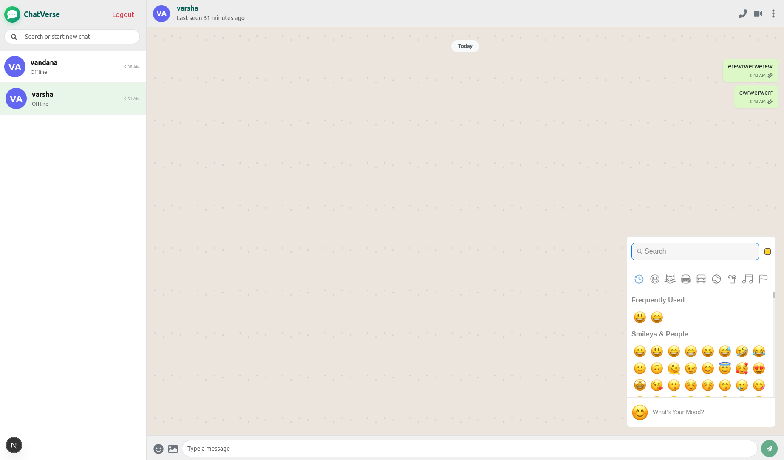

# 💬 ChatVerse - Modern Real-time Chat Application


A beautiful, real-time chat application built with Next.js, Express, MongoDB, and Socket.io. Experience seamless messaging with WhatsApp-style UI, image sharing, emoji picker, and real-time features.

## ✨ Features

### 🚀 Core Features
- **Real-time Messaging** - Instant message delivery with Socket.io
- **User Authentication** - Secure JWT-based login/register
- **Image Sharing** - Share images with friends
- **Emoji Picker** - Express yourself with emojis
- **Typing Indicators** - See when someone is typing
- **Read Receipts** - Single/Double checkmarks for message status
- **Online Status** - Real-time online/offline indicators
- **User Search** - Find users quickly
- **Responsive Design** - Works perfectly on all devices

## 📸 Screenshots

### Login Page


### Register Page


### Main Chat Interface



## 🛠️ Tech Stack

### Frontend
- **Next.js 14** - React framework with App Router
- **React Bootstrap** - UI components
- **Socket.io-client** - Real-time communication
- **Axios** - HTTP client
- **React Icons** - Beautiful icons
- **Emoji Picker React** - Emoji support
- **Moment.js** - Date formatting

### Backend
- **Node.js** - JavaScript runtime
- **Express.js** - Web framework
- **MongoDB Atlas** - Cloud database
- **Mongoose** - ODM
- **Socket.io** - WebSocket server
- **JWT** - Authentication
- **Bcryptjs** - Password hashing

## 🚀 Quick Start

### Prerequisites
- Node.js (v18 or higher)
- npm or yarn
- MongoDB Atlas account (or local MongoDB)

### Installation

1. **Clone the repository**
```bash
git clone https://github.com/VarshaVasudevan/chat-app-next-js
cd chat-app
